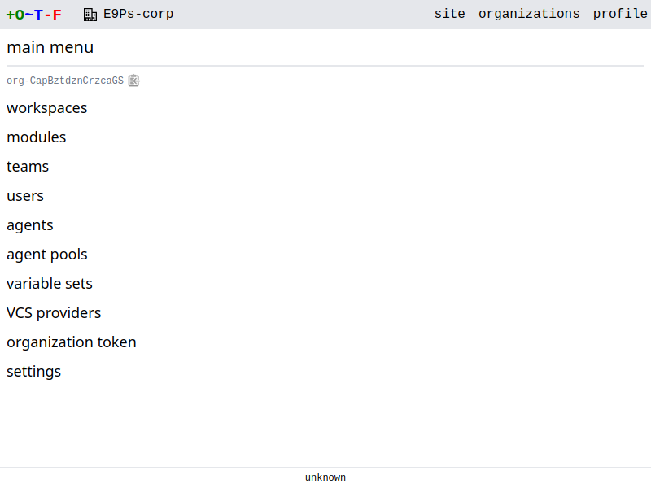
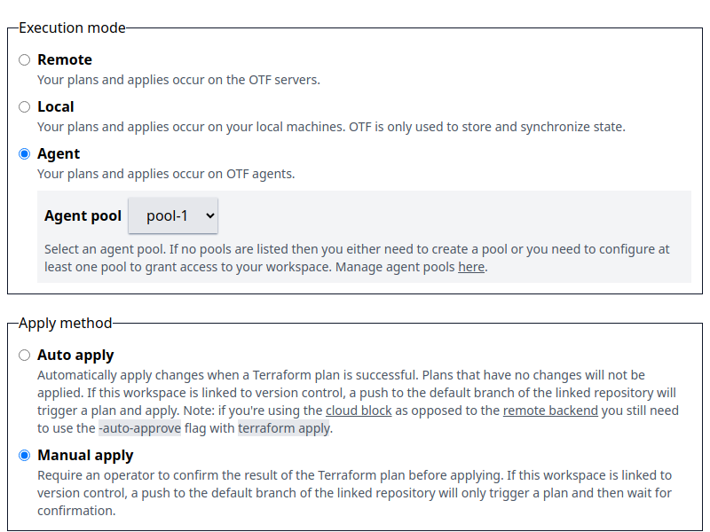
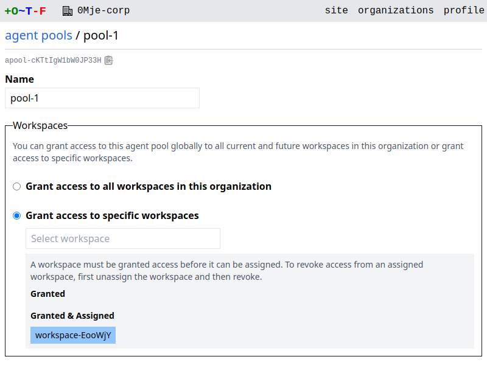
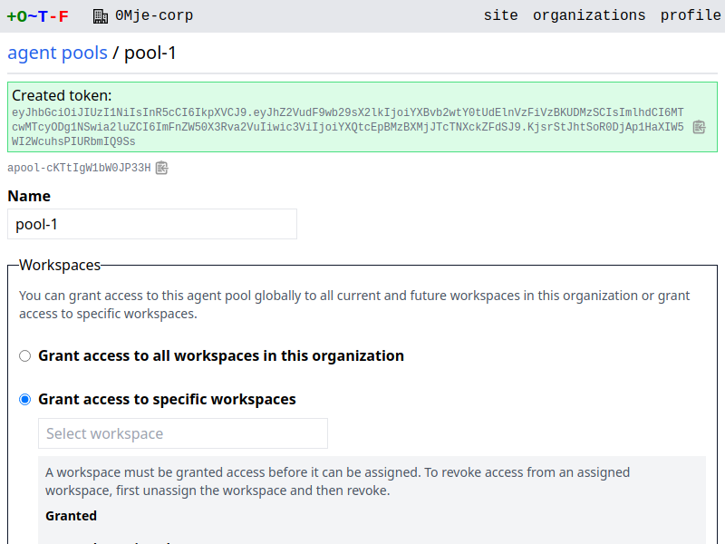

# Agents

An agent handles the execution of runs. There are two types of agents:

* The agent built into `otfd`, referred to as a *server agent*.
* The separate agent process, `otf-agent`, referred to as a *pool agent*.

## Server agents

A server agent handle runs for workspaces that are configured with the *remote* execution mode. It is built into the `otfd` process, so whenever you run `otfd` you are automatically running a server agent.

## Pool agents

A pool agent handles runs for workspaces that are configured with the *agent* execution mode. It is invoked as a dedicated process, `otf-agent`.

A pool agent belongs to an *agent pool*. An agent pool is a group of `otf-agent` processes that can be used to communicate with isolated, private, or on-premises infrastructure. Each agent pool has its own set of tokens which are not shared across pools. When a workspace is configured to execute runs using the *agent* execution mode, any available agent in that workspace's assigned agent pool is eligible to execute the run.

!!! note
    Pool agents are functionally equivalent to [Terraform Cloud Agents](https://developer.hashicorp.com/terraform/cloud-docs/agents).

### Walkthrough: pool agents

First, create an agent pool in your organization. Go to the organization main menu and select **agent pools**.

{.screenshot}

Select **New agent pool** to reveal the form.

{.screenshot}

Give the pool a name and click **Create agent pool**.

{.screenshot}

By default you can assign *any* workspace to the agent pool. To grant access only to specific workspaces, select **Grant access to specific workspaces**.

{.screenshot}

Select a workspace from the dropdown menu and it should be added to the list of granted workspaces.

{.screenshot}

Click **Save changes** to persist the change.

You then need to *assign* a workspace to the pool. Go to the settings of a workspace and change the execution mode to **agent**:

{.screenshot}

Click **Save changes** and return to the agent pool. You should see that the workspace is both *granted* and *assigned*.

{.screenshot}

Now create an agent token. A pool agent needs to authenticate with a token in order to join a pool. Click **New token** to reveal the form.

{.screenshot}

Give the token a description and click **Create token**.

{.screenshot}

Copy the token to your system clipboard. Now you can run the agent:

```bash
otf-agent --token <token> --address <otfd-hostname>
```

The agent should confirm it has registered successfully:

```bash
2023/12/04 21:52:06 INFO starting agent version=unknown
2023/12/04 21:52:06 INFO registered successfully agent.id=agent-NGB0H1QskahiN9xR agent
.server=false agent.status=idle agent.ip_address=192.168.1.155 agent.pool_id=apool-d68
ab60a67ccf4fc
2023/12/04 21:52:06 INFO waiting for next job
```

Go to the agent pool and you should see the agent listed:

{.screenshot}

You've successfully reached the end of this walkthrough. Any runs triggered on the workspace above will now be executed on the agent. You can create more agent pools and agents and assign workspaces to specific pools, giving you control over where runs are executed.
