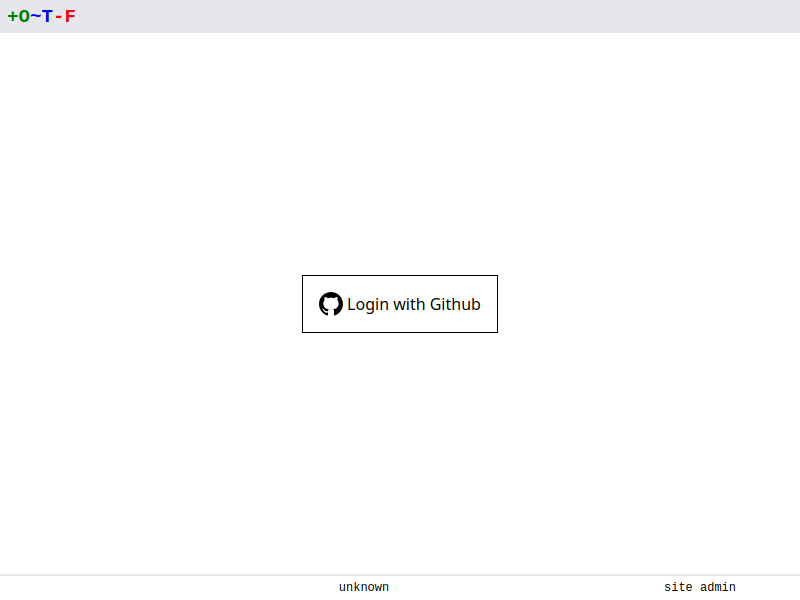

# Github

Configure OTF to sign users in using their Github account.

Create an OAuth application in Github by following their [step-by-step instructions](https://docs.github.com/en/developers/apps/building-oauth-apps/creating-an-oauth-app).

* Set application name to something appropriate, e.g. `otf`
* Set the homepage URL to the URL of your otfd installation (although this is purely informational).
* Set an optional description.
* Set the authorization callback URL to:

    `https://<otf_hostname>/oauth/github/callback`

!!! note
    It is recommended that you first set the [`--hostname` flag](../../../config/flags/#-hostname) to a hostname that is accessible by Github, and that you use this hostname in the authorization callback URL above.

Once you've registered the application, note the client ID and secret.

Set the following flags when running `otfd`:

```
otfd --github-client-id=<client_id> --github-client-secret=<client_secret>
```

If you're using Github Enterprise you'll also need to inform `otfd` of its hostname:

```
otfd --github-hostname=<hostname>
```

Now when you start `otfd`, navigate to its URL in your browser and you'll be prompted to login with Github.

{.screenshot}

!!! note
    In previous versions of OTF, Github organizations and teams were synchronised to OTF. This functionality was removed as it was deemed a security risk.
