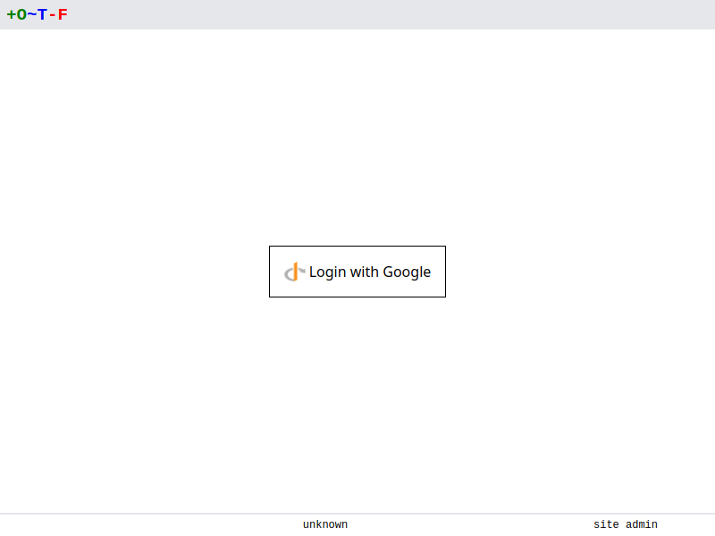

# OIDC

You can configure OTF to sign users in using [OpenID-Connect](https://openid.net/connect/) (OIDC). The OIDC authentication provider uses an upstream identity provider(idp) such as [Azure AD](https://learn.microsoft.com/en-us/azure/active-directory/develop/v2-protocols-oidc), [Google](https://developers.google.com/identity/openid-connect/openid-connect), or [Dex](https://dexidp.io/).

Create an Application for OTF in your preferred idp.

* Set the name to something appropriate, e.g. `otf`
* Add the following `redirect uri` to the application:

    `https://<otfd_install_hostname>/oauth/<oidc_name>/callback`

Once you've created the application note the client id and secret.

Set the following flags when running otfd:

* `--oidc-name=<oidc_name>` which is the user-friendly name of the idp. This can be something like `azure-sso`, or `google`.
* `--oidc-issuer-url=<issuer-url>` which is the URL of the idp's oidc configuration. This varies depending on the identity provider used.
* `--oidc-client-id=<client-id>` which is the `client-id` generated by the idp when we created the application.
* `--oidc-client-secret=<client-secret>` which is the `client-secret` generated by the idp when we created the application.

Now when you start `otfd`, navigate to its URL in your browser and you'll be prompted to login with your OIDC provider:

{.screenshot}
