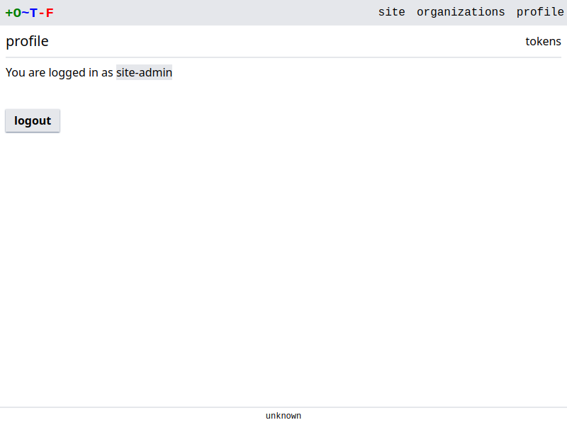

# Site Admin

The `site-admin` user allows for exceptional access to OTF. The user possesses unlimited privileges and uses a token to sign-in. See the documentation for the [`--site-token` flag](../../config/flags/#-site-token) for details on how to set the token.

!!! note
    Keep the token secure. Anyone with access to the token has complete access to OTF.

You can sign into the web UI using the token. Use the link found in the bottom right corner of the login page:

{.screenshot}
{.screenshot}
{.screenshot}

!!! note
    Use of the site admin token is recommended only for one-off administrative and testing purposes. You should use an Identity Provider in most cases.
