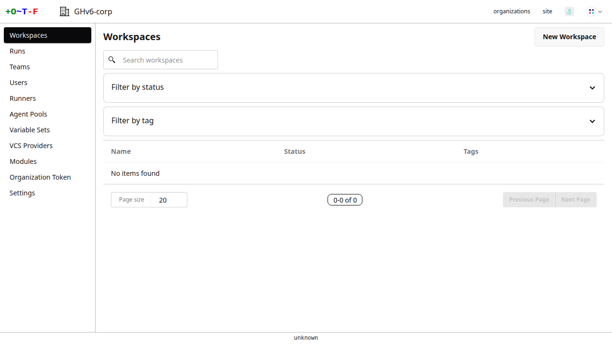
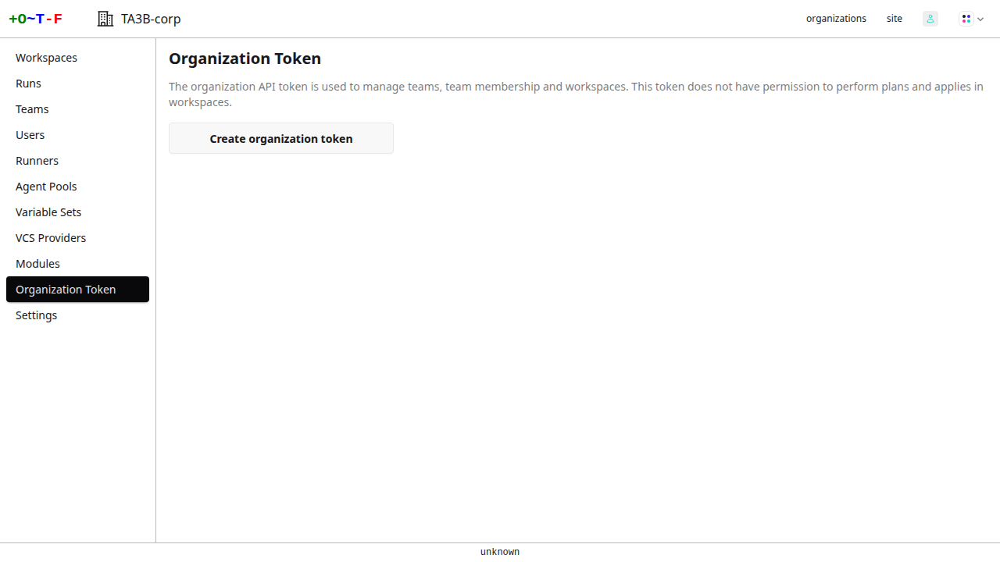
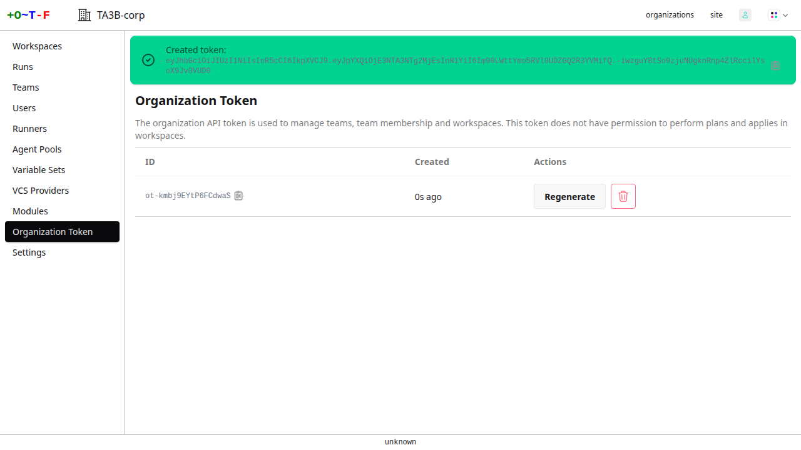

# Organization Tokens

Each organization can have an API token. Only an owner can create or delete the token.

They are equivalent to organization tokens in [Terraform Cloud](https://developer.hashicorp.com/terraform/cloud-docs/users-teams-organizations/api-tokens#organization-api-tokens). They possess the same permissions as those documented for Terraform Cloud.

To manage your tokens, go to your organization main menu and select **organization token**:

{.screenshot .crop}

Create the token:

{.screenshot .crop}

The token is displayed:

{.screenshot .crop}

Click the clipboard icon to copy the token to your system clipboard. You can then use the token to authenticate via the [API](https://developer.hashicorp.com/terraform/cloud-docs/api-docs) or the `otf` CLI.
