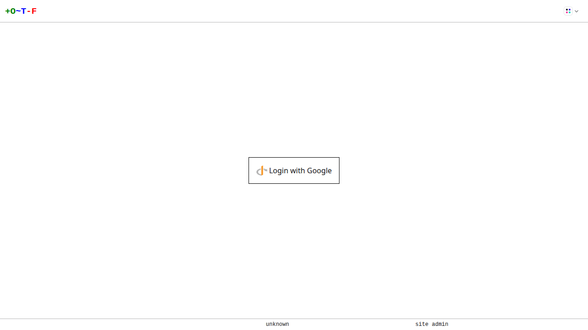

# OIDC

You can configure OTF to sign users in using [OpenID-Connect](https://openid.net/connect/) (OIDC). The OIDC authentication provider allows using an upstream identity provider (IdP) such as [Azure AD](https://learn.microsoft.com/en-us/azure/active-directory/develop/v2-protocols-oidc), [Google](https://developers.google.com/identity/openid-connect/openid-connect), or [Dex](https://dexidp.io/).

Configure OIDC on your preferred IdP (the extra process depends on the IdP):

* Set the OIDC scopes to match those configured in OTF (see below).
* Set the redirect URI to:

    `https://<otfd_install_hostname>/oauth/<oidc_name>/callback` (see below for configuring the `oidc_name`)

Once you've configured OIDC on the IdP, take a note of the client ID and client secret.

Set the following flags when running `otfd`:

* `--oidc-name=<oidc_name>` - the user-friendly name of the IdP. This can be something like `azure-sso`, or `google`. Note that this affects the redirect URI you configure on the IdP (see above).
* `--oidc-issuer-url=<issuer-url>` - the URL of the IdP's OIDC configuration. This varies depending on the IdP.
* `--oidc-client-id=<client-id>` - the client ID generated by the IdP.
* `--oidc-client-secret=<client-secret>` - the client secret generated by the IdP.

Optionally, you can set additional flags to override defaults:

* `--oidc-scopes=<scope1,scope2,...>` - overrides the [scopes](https://openid.net/specs/openid-connect-basic-1_0.html#Scopes). The default is `openid,profile`. You should at a minimum specify the `openid` scope.
* `--oidc-username-claim=<claim>` - this determines which claim is mapped to a username in OTF. It defaults to `name`. You can set it to `name`, `email`, or `sub`.

!!! note
    The choice of `--oidc-username-claim` has important security implications.  If users can log into the OIDC provider and modify their own `name` (full name) or `email`, those claims should not be used for OIDC authentication.  When combined with the `--site-admins` argument, users could gain administrative access simply by changing their full name or email to match yours.
    The [OIDC specification](https://openid.net/specs/openid-connect-core-1_0.html#ClaimStability) strongly recommends the use of `sub` for uniquely identifying users.
    If you override the claim you may well need to override the scopes too, e.g. the `email` claim often needs the `email` scope configured.

Now when you start `otfd`, navigate to its URL in your browser and you'll be prompted to login with your OIDC provider:

{.screenshot}
