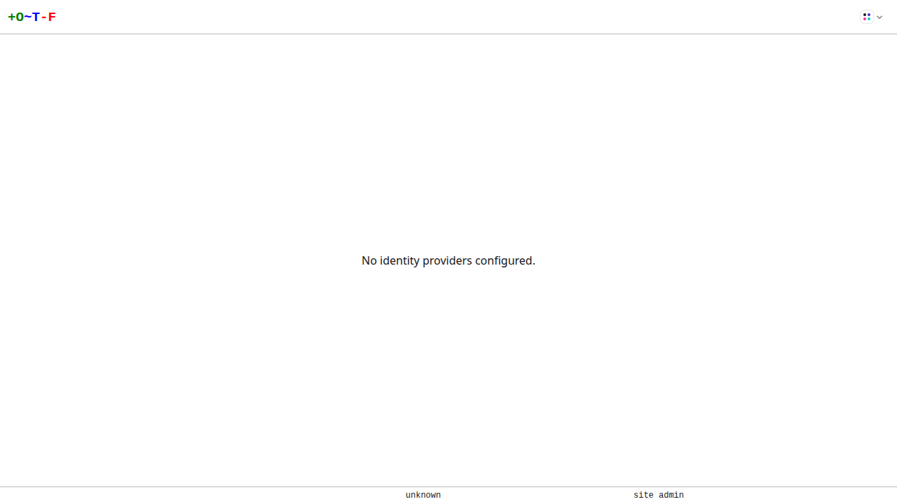
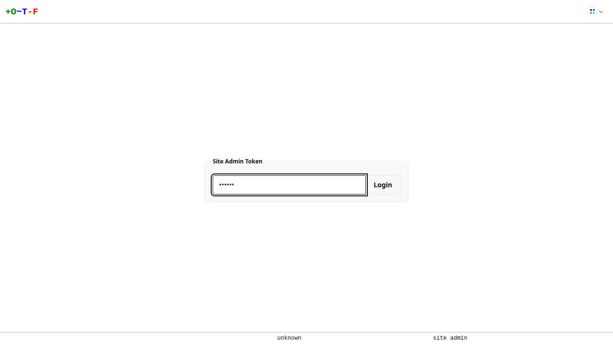
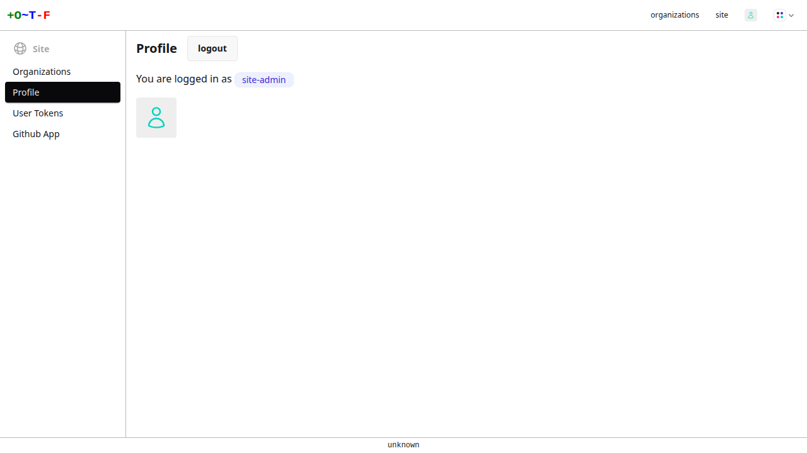

# Site Admins

Site admins possesses supreme privileges to an OTF installation. There are two ways to assume the role:

* Promote users to the role using the [`--site-admins`](../config/flags.md#-site-admins) flag.
* Set a token with the [`--site-token`](../config/flags.md#-site-token) flag and use it to login as the built-in `site-admin` user

## Promoting users

To promote users to the role, simply set the [`--site-admins`](../config/flags.md#-site-admins) flag. There is no need to re-login.

## Site token

Set a site token with the [`--site-token`](../config/flags.md#-site-token) flag. You can use the token with the API, CLI, and the web UI.

To use it to login to the web UI, use the link in the bottom right corner of the login page:

{.screenshot}
{.screenshot}
{.screenshot}

!!! note
    Keep the token secure. Anyone with access to the token has complete access to OTF. Use of the site admin token is recommended only for one-off administrative and testing purposes. You should use an Identity Provider in most cases.
