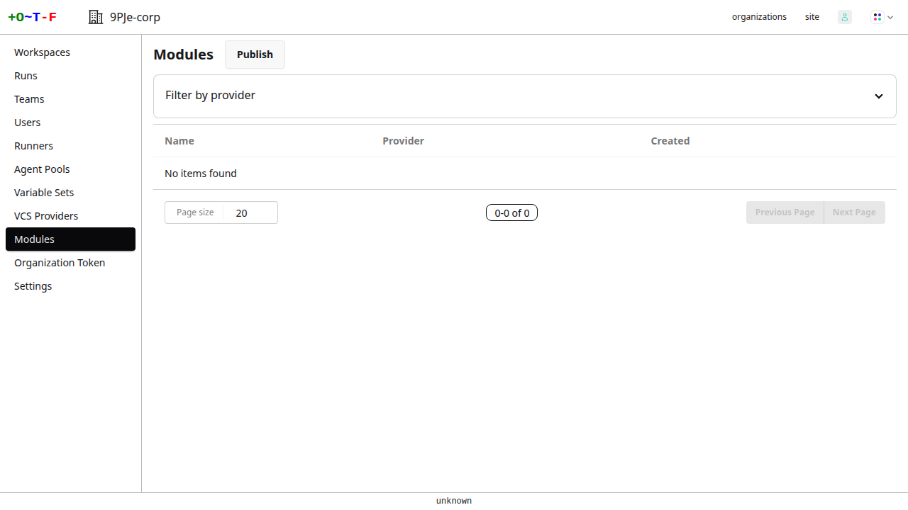
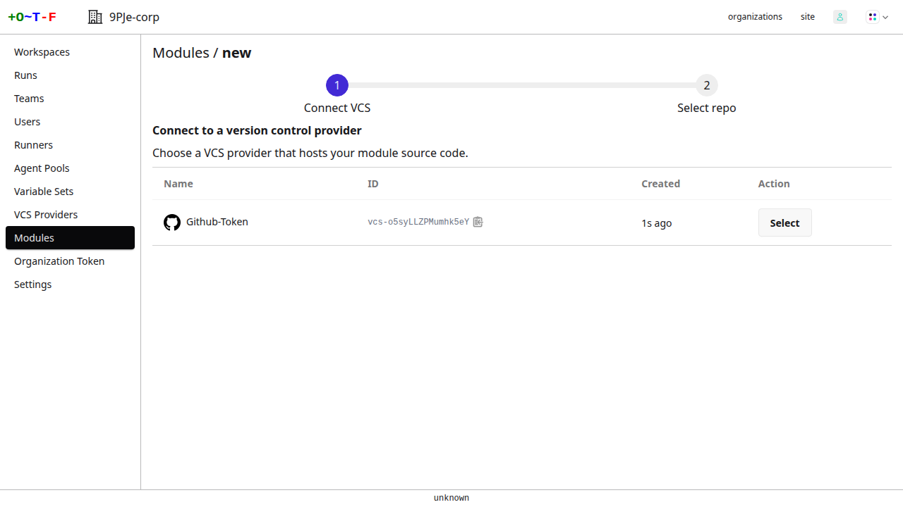
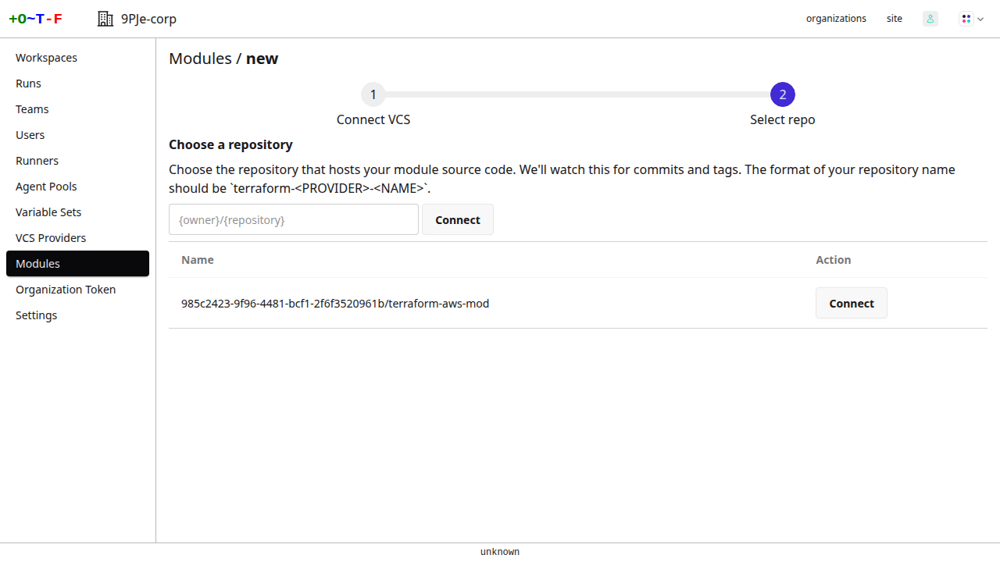
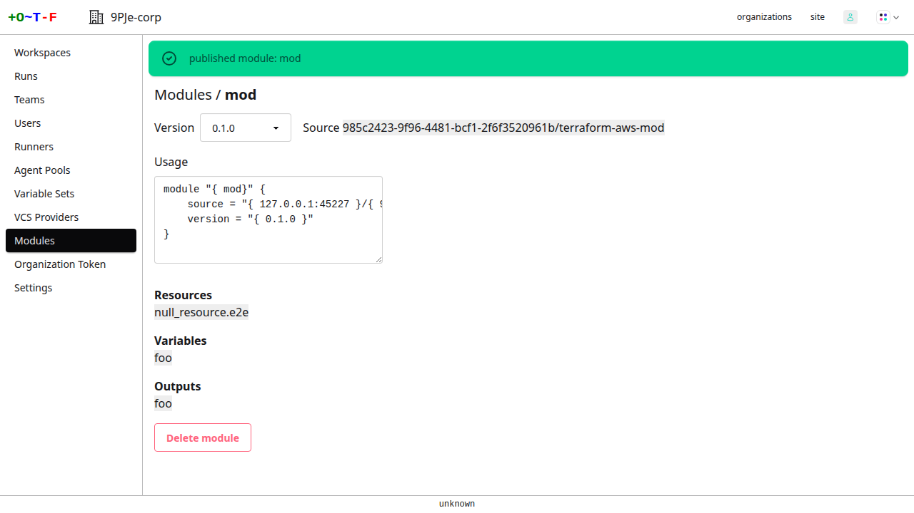

# Module Registry

OTF includes a registry of terraform modules. You can publish modules to the registry from a git repository and source the modules in your terraform configuration.

## Publish module

To publish a module, go to the organization main menu, select **modules** and click **publish**

{.screenshot}

You then need to select a VCS provider. If none are visible you need to first create a [provider](./vcs_providers/index.md).

{.screenshot}

Connect to the provider and you are presented with a list of git repositories. Select the repository that contains the module you want to publish. If the repository is not visible you can enter its path instead.

{.screenshot}

!!! note
    Only the first 100 repositories found on your provider are shown.

Select a repository. OTF then publishes the module.

{.screenshot}

!!! note
    Ensure your repository has at least one tag that looks like a semantic version. Otherwise OTF will fail to publish the module.

OTF retrieves the repository's git tags. For each tag that looks like a semantic version, e.g. `v1.0.0` or `0.10.3`, it'll download the contents of the repository for each tag and publish a module with that version. You should then be redirected to the module's page, containing information regarding its resources, inputs and outputs, along with usage instructions.

A webhook is also added to the repository. Any tags pushed to the repository will trigger the webhook and new module versions will be published.
