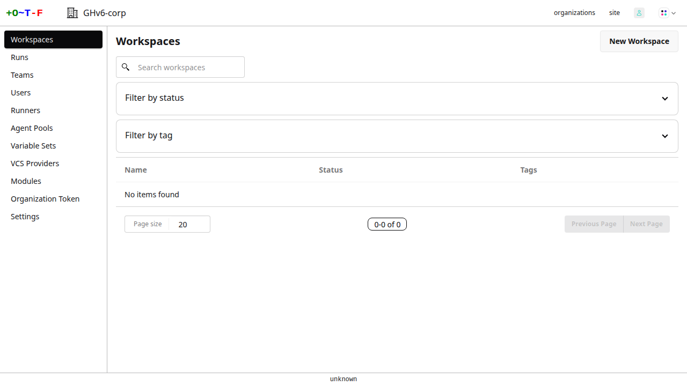
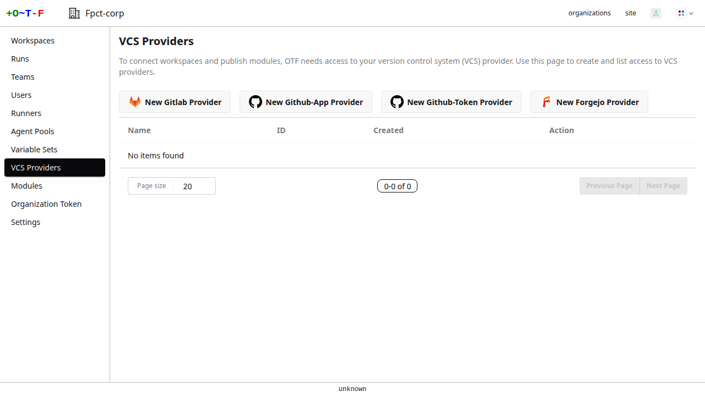
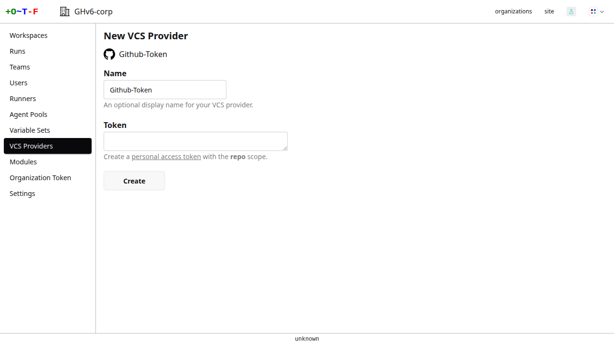
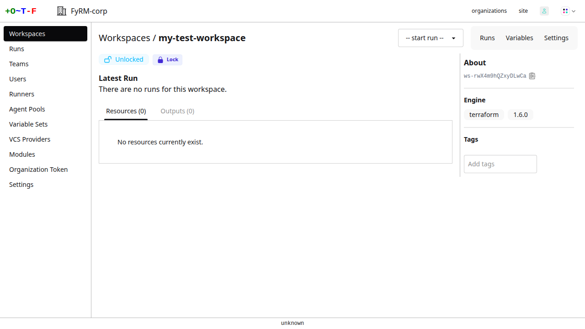
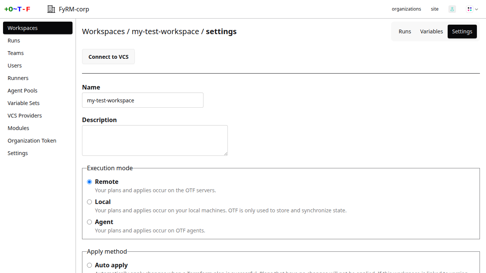
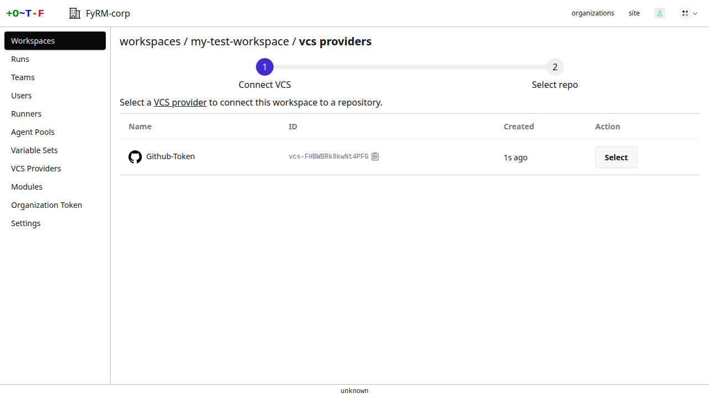
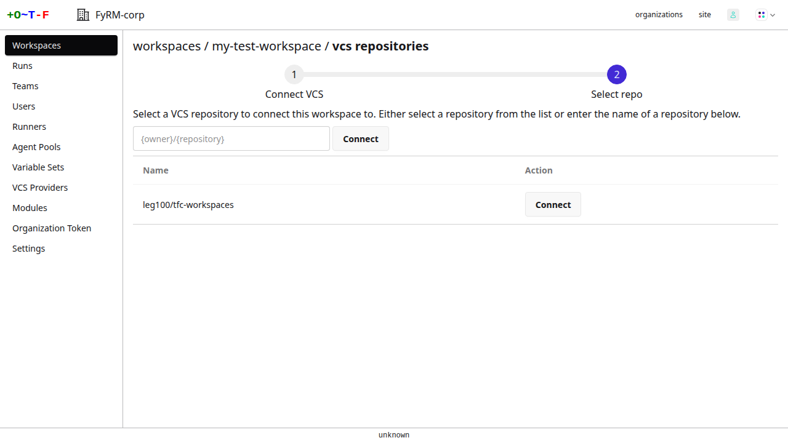
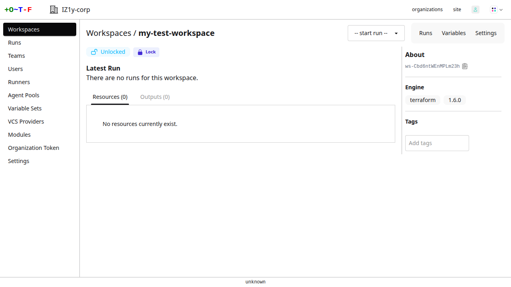
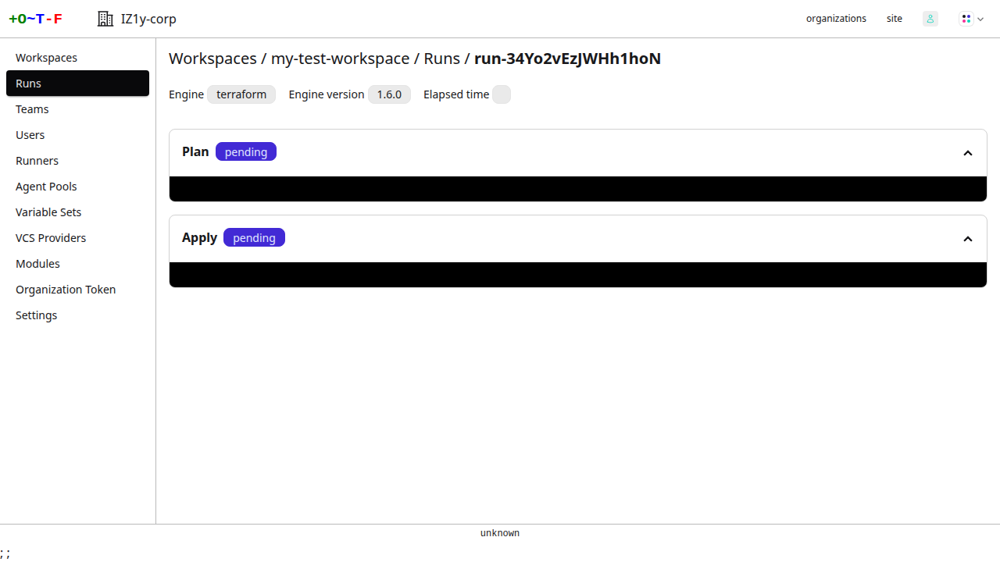

# VCS Providers

To connect workspaces and modules to git repositories containing Terraform configurations, you need to provide OTF with access to your VCS provider. You have a choice of four providers:

* [Github app](github_app.md)
* Github personal access token
* Gitlab personal access token
* [Forgejo personal access token](forgejo_setup.md)

## Walkthrough

This walkthrough shows you how to create a VCS provider via the web UI.

On your organization's main menu, select **VCS providers**.

{.screenshot}

You are presented with a choice of providers to create:

{.screenshot}

In this walkthrough we will create a provider using a Github personal access token.

Select **New Github VCS Provider (Personal Token)**. You are then presented with a form on which to enter the token:

{.screenshot}

Click the **personal token** link. It'll take you to Github where you can create the token. Create a **classic** token with the **repo** scope (or you can create a fine-tuned token with the equivalent permissions). The token permits OTF to access your git repository and retrieve terraform configuration. Once you've generated the token, copy and paste it into the **Token** field. Optionally you can also assign the provider a name.

Create the provider and it'll appear on the list of providers:

{.screenshot}

You can now proceed to connecting workspaces (see below) and [publishing modules](registry.md).

### Connecting a workspace

Once you have a provider you can connect a workspace to a git repository for that provider.

Select a workspace. Go to **settings**.

{.screenshot}

Click **Connect to VCS**.

{.screenshot}

Select the provider.

{.screenshot}

You'll then be presented with a list of repositories. Select the repository containing the terraform configuration you want to use in your workspace. If you cannot see your repository you can enter its name.

{.screenshot}

Once connected you can start a run via the web UI. On the workspace page select the **start run** drop-down box and select an option to either start a plan or both a plan and an apply.

{.screenshot}

That will start a run, retrieving the configuration from the repository, and you will see the progress of its plan and apply.

{.screenshot}
