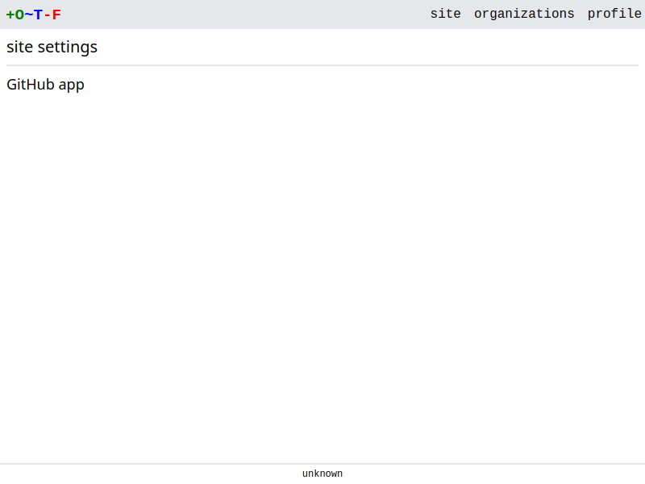
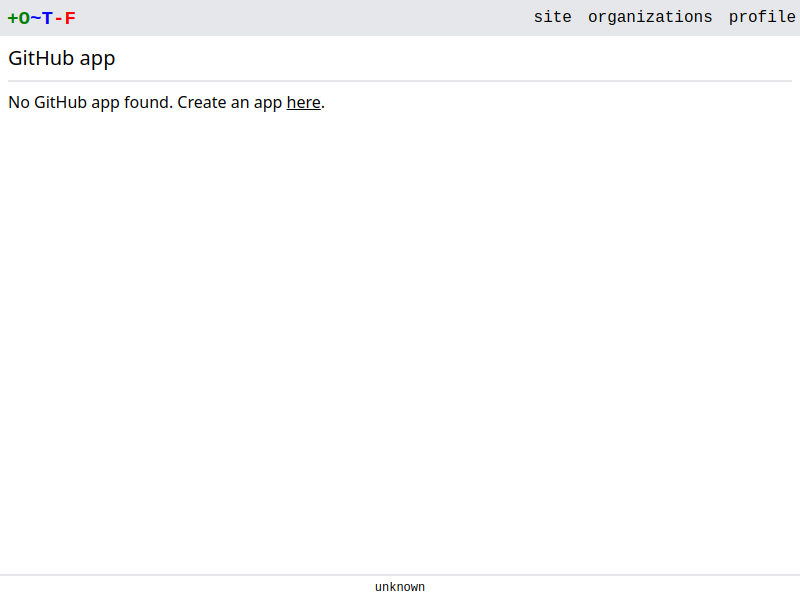
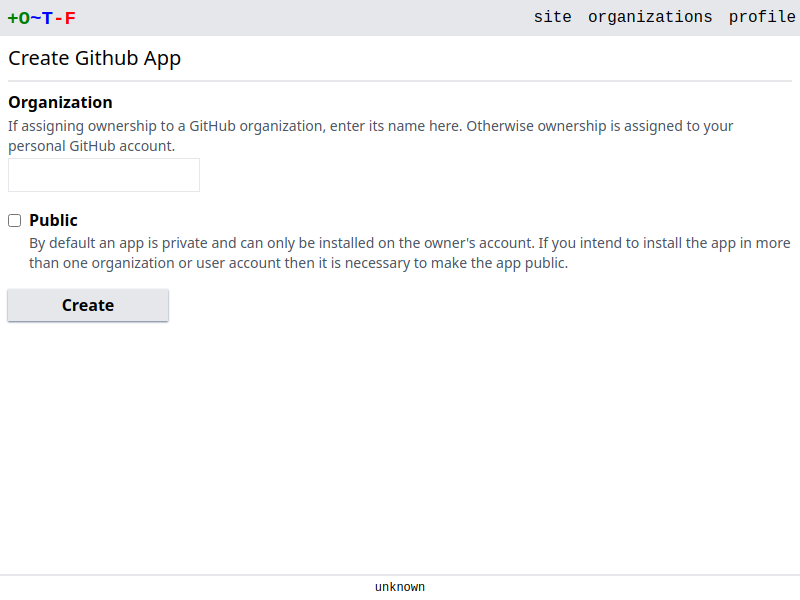
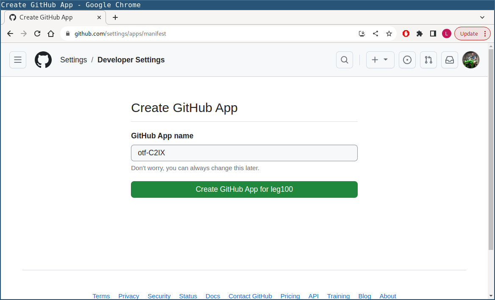
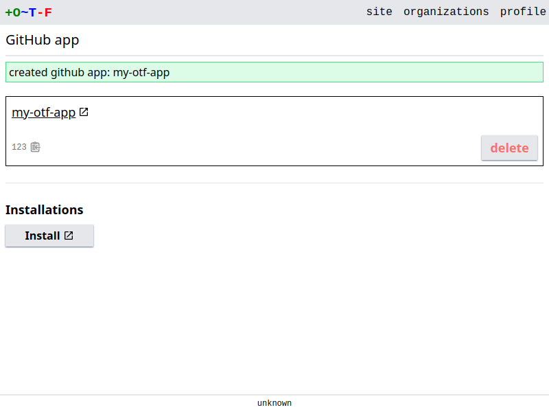
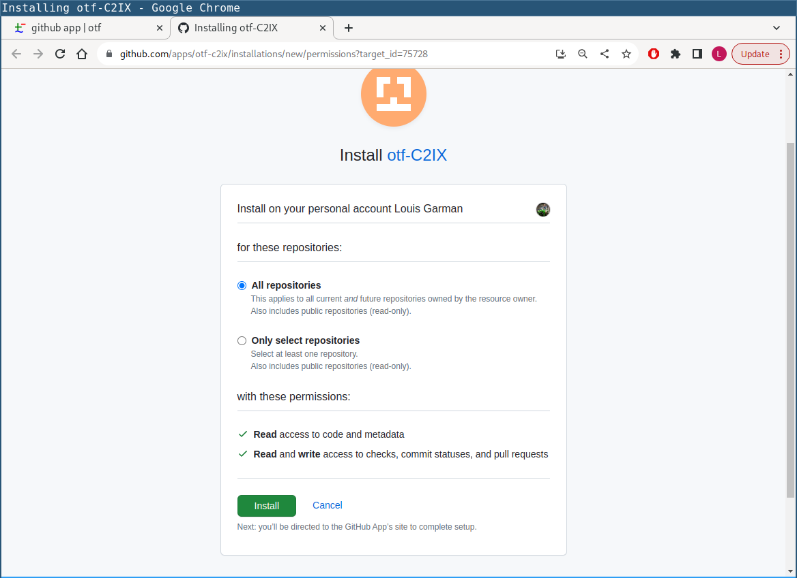
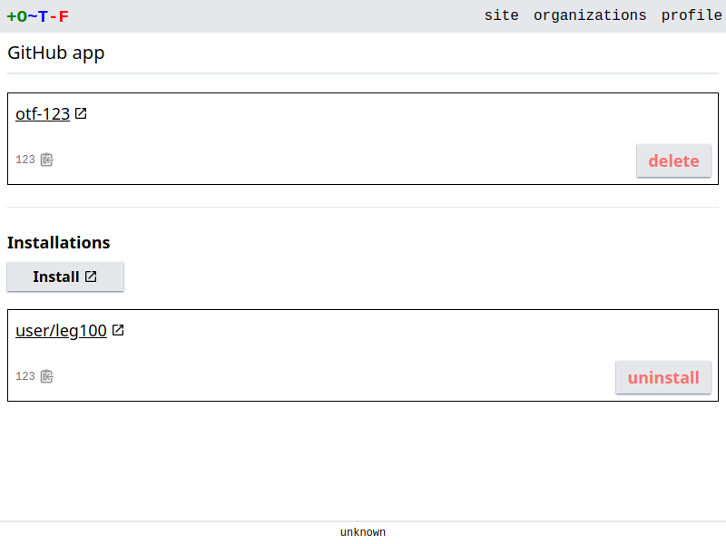

# Github app

OTF provides the ability to create a [Github app](https://docs.github.com/en/apps/creating-github-apps/about-creating-github-apps/about-creating-github-apps). The app can then be used as an alternative to a personal access token for a VCS provider, offering the following advantages:

* Unlike a personal token, an app is [not necessarily tied to an individual's personal Github account](https://docs.github.com/en/apps/creating-github-apps/about-creating-github-apps/deciding-when-to-build-a-github-app#choosing-between-a-github-app-or-a-personal-access-token). Instead it can be owned and installed into a Github organization. If an individual leaves an organization then the app continues to function.
* The app can be installed into more than Github account. For instance, if you install the app into Github organizations `dev` and `prod` you can then create VCS providers for those installations respectively, restricting their access to the repositories belonging to each organization.
* An app comes with [its own webhook](https://docs.github.com/en/apps/creating-github-apps/about-creating-github-apps/deciding-when-to-build-a-github-app#github-apps-have-built-in-webhooks). Therefore, unlike with personal tokens, OTF does not need to create webhooks on Github repositories. This can be advantage if you want to overcome the maximum 20 webhook per-repo limit (OTF creates a separate webhook on a repo for each VCS provider if using a personal token).
* An app has a higher [maximum possible rate-limit](https://docs.github.com/en/apps/creating-github-apps/registering-a-github-app/rate-limits-for-github-apps).
* The github app creation process automatically persists the app credentials to the database. There is no copying-and-pasting of credentials involved.

!!! note
    Github apps also have access to a richer API for status checks. A future version of OTF will take advantage of this.

## Create the app

Select **site** in the top right corner menu to take you to the site settings page:

{.screenshot}

Select **GitHub app**. You are then prompted to create an app:

{.screenshot}

Select the link to create a new app. You are presented with a form to create the app:

{.screenshot}

An app has an owner. By default your github personal account is the owner. If you would prefer a Github organization to own the application then enter the name of the organization.

An app is *private* by default. That means the app can only be installed into the Github account that owns the app, and only repositories in that account will be accessible to OTF. If you want to install the app into more than one Github account then you need to select the **Public** checkbox. (This can be changed once the app has been created, via the app settings page on Github).

Click **Create** and you are redirected to Github. You are given the opportunity to set a name (it must be globally unique and cannot match the name of a Github account):

{.screenshot}

Click the **Create GitHub App for ...** button.

You're then redirected back to OTF, where details of the app are now visible:

{.screenshot}

## Install the app

Once you've created the app you need to install it.

On the Github app page, click the **Install** button:

{.screenshot}

You are re-directed to Github, where you can select the repositories that are to be made accessible to OTF:

{.screenshot}

!!! note
    If you created a *public* app earlier you will first be presented with a choice of accounts to install the app into.

Click the **Install** button and you'll be re-directed back to OTF. The installation should now be listed:

{.screenshot}

You can create a [VCS provider](vcs_providers.md) from the installation.
