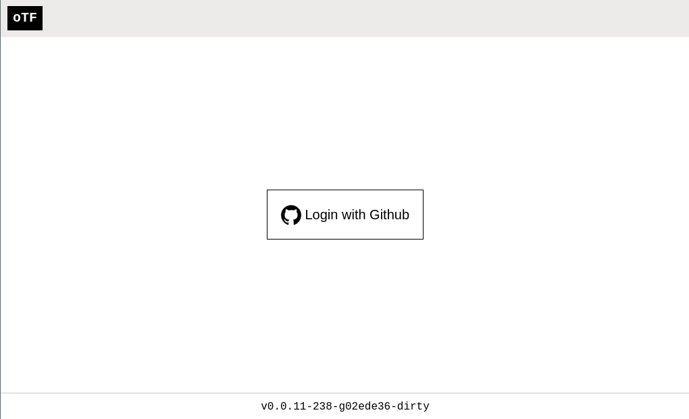

# OTF

OTF is an open-source alternative to Terraform Enterprise, sharing many of its features:

* Full Terraform CLI integration
* Remote execution mode: plans and applies run on server
* Agent execution mode: plans and applies run on agents
* Remote state backend: state stored in PostgreSQL
* SSO: sign in using github and gitlab
* Organization and team synchronisation from github and gitlab
* Authorization: control team access to workspaces
* VCS integration: start runs from your git repository
* Compatible with much of the Terraform Enterprise/Cloud API
* Minimal dependencies: requires only PostgreSQL
* Stateless: horizontally scale servers in pods on Kubernetes, etc

Feel free to trial it using the demo deployment: [https://demo.otf.ninja](https://demo.otf.ninja)

## Requirements

* Linux - the server and agent components are tested on Linux only; the client CLI is not tested on other platforms but should work.
* PostgreSQL - at least version 12.
* An SSL certificate.

## Installation

### Download

There are three components that can be downloaded:

* `otfd` - the server daemon
* `otf` - the client CLI
* `otf-agent` - the agent daemon

Download them from [Github releases](https://github.com/leg100/otf/releases).

The server and agent components are also available as docker images:

* `leg100/otfd`
* `leg100/otf-agent`

### Quick install

These steps will get you started with running the server on your local system.

Download a [release](https://github.com/leg100/otf/releases) of the server component, `otfd`. The release is a zip file. Extract the `otfd` binary to your current directory.

Ensure you have access to a postgres server. otf by default assumes postgres is running locally, accessible via a domain socket in `/var/run/postgresql`, and defaults to using a database named `otf`. You need to create the database first:

```bash
createdb otf
```

otfd requires a secret for creating cryptographic signatures. It should be up to 64 characters long and you should use a cryptographically secure random number generator, e.g.:

```bash
> openssl rand -hex 32
56789f6076a66323643f57a1016cdde7e7e39914785d36d61fdd8b9a30081f14
```

To get up and running quickly, we'll use the **site admin** account. This account has complete privileges and should only be used for administrative tasks rather than day-to-day usage. To use the account you need to set a token, which can any combination of characters. Make a note of this.

Now start the otf daemon with both the secret and the token:

```bash
> ./otfd --secret=my-secret --site-token=my-token
2022-10-30T20:06:10Z INF started cache max_size=0 ttl=10m0s
2022-10-30T20:06:10Z INF successfully connected component=database path=postgres:///otf?host=/var/run/postgresql
2022-10-30T20:06:10Z INF goose: no migrations to run. current version: 20221017170815 compone
nt=database
2022-10-30T20:06:10Z INF started server address=[::]:8080 ssl=false
```

You have now successfully installed `otfd` and confirmed you can start `otfd` with minimal configuration. Proceed to create your first organization.

#### Create organization

You can navigate to the web app in your browser:

[http://localhost:8080](http://localhost:8080)

Note it announces you have 'no authenticators configured'. The normal method of login is to use SSO signin, via Github etc, but in this quickstart we're using the site admin account. Click on the 'site admin' link in the bottom right, and use your token to login.

Go to 'organizations' and click `New Organization`. Give the organization a name and create.

#### Run Terraform

!!! Note
    The terraform CLI will be connecting to the server and it expects to make a verified SSL connection. Therefore we need to configure SSL first.

Generate a self-signed SSL certificate and key:

```bash
openssl req -x509 -newkey rsa:4096 -sha256 -keyout key.pem -out cert.crt -days 365 -nodes -subj '/CN=localhost' -addext 'subjectAltName=DNS:localhost'
```
    
Ensure your system trusts the generated cert. For example, on Ubuntu based systems:

```bash
sudo cp cert.crt /usr/local/share/ca-certificates
sudo update-ca-certificates
```

Now return to the terminal in which `otfd` is running. You'll need to kill it and start it again, this time with SSL enabled:
    
```bash
> ./otfd --secret=my-secret --site-token=my-token --ssl --cert-file=cert.crt --key-file=key.pem
```

Terraform needs to use your token to authenticate with `otfd`:

```bash
terraform login localhost:8080
```

Enter `yes` to proceed.

!!! bug
    You'll notice `terraform login` opens a browser window. However it ignores the port, thereby failing to open the correct page on the server. Once you properly deploy the server on a non-custom port this won't be a problem.

Ignore the browser window it has opened and enter your token at the terminal prompt. You should receive confirmation of success:

```
Success! Logged in to Terraform Enterprise (localhost:8080)
```

Now we'll write some terraform configuration. Configure the terraform backend and define a resource:

```bash
cat > main.tf <<EOF
terraform {
  backend "remote" {
    hostname = "localhost:8080"
    organization = "default"

    workspaces {
      name = "dev"
    }
  }
}

resource "null_resource" "quickstart" {}
EOF
```

Initialize terraform:

```bash
terraform init
```

Run a plan:

```bash
terraform plan
```

That starts a run on the server. You can click on the link to the run to view status and logs.

And apply:

```bash
terraform apply
```

This starts another run on the server. Again you can click on the link to see logs.

You have reached the end of this quickstart guide. Have a look at the remainder of the documentation to further complete the installation of otf, to setup SSO, run agents, etc.

### Install from source

You'll need [Go](https://golang.org/doc/install).

Clone the repo, then build and install using the make task:

```bash
git clone https://github.com/leg100/otf
cd otf
make install
```

That'll install the binaries inside your go bin directory (defaults to `$HOME/go/bin`).

### Install helm chart

You can install the otf server on Kubernetes using the helm chart.

```bash
helm repo add otf https://leg100.github.io/otf-charts
helm upgrade --install otf otf/otf
```

To see all configurable options with detailed comments:

```
helm show values otf/otf
```

!!! note
    The helm chart is maintained in a separate [github repo](https://github.com/leg100/otf-charts).

## Authentication

Users sign into OTF primarily via an SSO provider. Support currently exists for:

* Github
* Gitlab

Alternatively, an administrator can sign into OTF using a Site Admin token. This should only be used ad-hoc, e.g. to investigate issues.

### Github SSO

You can configure otf sign users in using their github account. Upon sign in, their organizations and teams are automatically synchronised across to otf.

Create an OAuth application in github by following their [step-by-step instructions](https://docs.github.com/en/developers/apps/building-oauth-apps/creating-an-oauth-app).

* Set application name to something appropriate, e.g. `otf`
* Set the homepage URL to the URL of your otfd installation (although this is purely informational).
* Set an optional description.
* Set the authorization callback URL to:

    `https://<otfd_install_hostname>/oauth/github/callback`

Once you've registered the application, note the client ID and secret.

Set the following flags when running otfd:

    `--github-client-id=<client_id>`
    `--github-client-secret=<client_secret>`

If you're using github enterprise you'll also need to inform otfd of its hostname:

    `--github-hostname=<hostname>`

Now when you start `otfd` navigate to its URL in your browser and you'll be prompted to login with github:

> 

#### Organization and team synchronization

Upon sign in, a user's organization and team memberships are synchronised from Github to OTF. If the organization or team does not exist in OTF then it is created.

If the user is an admin of a Github organization then they are made a member of the **owners** team in OTF. The same applies to members of any team named **owners** in Github. Because the owners team has admin privileges across an organization in OTF care should be taken with membership of this team in Github.

### Gitlab SSO

TODO

### Site Admin

The site admin user has supreme privileges. To enable the user, set its token when starting `otfd`:

```bash
./otfd --site-token=643f57a1016cdde7e7e39914785d36d61fd
```

Ensure the token is no more than 64 characters. You should use a cryptographically secure random number generator, for example using `openssl`:

```bash
openssl rand -hex 32
```

!!! note
    Keep the token secure. Anyone with access to the token has complete access to otf.

!!! note
    You can also set the token using the environment variable `OTF_SITE_TOKEN`.

You can sign into the web app via a link in the bottom right corner of the login page.

You can also use configure the `otf` client CLI and the `terraform` CLI to use this token:

```bash
terraform login <otf hostname>
```

And enter the token when prompted. It'll be persisted to a local credentials file.

!!! note
    This is recommended only for testing purposes. You should use your SSO account in most cases.

## VCS Providers

VCS providers allow you to connect workspaces to git repositories. Once connected , you can trigger runs that source their configuration from a repository.

Firstly, create a provider for your organization. On your organization's main menu, select 'VCS providers'.

You'll be presented with a choice of providers to create. The choice is restricted to those for which you have enabled [SSO](#authentication). For instance, if you have enabled Github SSO then you can create a Github VCS provider.

Select the provider you would like to create. You will then be prompted to enter a personal access token. Instructions for generating the token are included on the page. The token permits OTF to access your git repository and retrieve terraform configuration. Once you've generated and inserted the token into the field you also need to give the provider a name that describes it. 

!!! note
    Be sure to restrict the permissions on the token according to the instructions.

!!! note
    Other options for credentials will be offered in future, including OAuth access tokens.

Create the provider and it'll appear on the list of providers. You can now proceed to connecting workspaces to the provider.

### Connecting a workspace

Once you have a provider you can connect a workspace to a git repository for that provider.

Select a workspace. Go to its 'settings' (in the top right of the workspace page).

Click 'Connect to VCS'.

Select the provider.

You'll then be presented with a list of repositories. Select the repository containing the terraform configuration you want to use in your workspace. If you cannot see your repository you can enter its name.

Once connected you can start a run via the web UI. On the workspace page select the 'start run' drop-down box and select an option to either start a plan or both a plan and an apply.

That will start a run, retrieving the configuration from the repository, and you will see the progress of its plan and apply.

## Agents

OTF agents are dedicated processes for executing runs. They are functionally equivalent to [Terraform Cloud Agents](https://developer.hashicorp.com/terraform/cloud-docs/agents).


The `otf-agent` process maintains an outbound connection to the otf server; no inbound connectivity is required. This makes it suited to deployment in parts of your network that are segregated. For example, you may have a kubernetes cluster for which connectivity is only possible within a local subnet. By deploying an agent to the subnet, terraform can connect to the cluster and provision kubernetes resources.

!!! Note
    An agent only handles runs for a single organization.

### Setup agent

* Log into the web app.
* Select an organization. This will be the organization that the agent handles runs on behalf of.
* Ensure you are on the main menu for the organization.
* Select `agent tokens`.
* Click `New Agent Token`.
* Provide a description for the token.
* Click the `Create token`.
* Copy the token to your clipboard (clicking on the token should do this).
* Start the agent in your terminal:

```bash
otf-agent --token <the-token-string> --address <otf-server-hostname>
```

* The agent will confirm it has successfully authenticated:

```bash
2022-10-30T09:15:30Z INF successfully authenticated organization=automatize
```

### Configure workspace

* Login into the web app
* Select the organization in which you created an agent
* Ensure you are on the main menu for the organization.
* Select `workspaces`.
* Select a workspace.
* Click `settings` in the top right menu.
* Set `execution mode` to `agent`
* Click `save changes`.

Now runs for that workspace will be handled by an agent.

## Client CLI

`otf` is a CLI program for interacting with the server.

Download a [release](https://github.com/leg100/otf/releases). Ensure you select the client component, `otf`. The release is a zip file. Extract the `otf` binary to a directory in your system PATH.

Run `otf` with no arguments to receive usage instructions:

```bash
Usage:
  otf [command]

Available Commands:
  agents        Agent management
  help          Help about any command
  organizations Organization management
  workspaces    Workspace management

Flags:
      --address string   Address of OTF server (default "localhost:8080")
  -h, --help             help for otf

Use "otf [command] --help" for more information about a command.
```

Credentials are sourced from the same file the terraform CLI uses (`~/.terraform.d/credentials.tfrc.json`). To populate credentials, run:

```bash
terraform login <otfd_hostname>
```

!!! note
    `terraform login` has a bug wherein it ignores the port when opening a browser. If you have included a port, e.g. `localhost:8080`, then you'll need to fix the URL in the browser address bar accordingly.

!!! note
    Functionality is presently limited, restricted to a subset of what is available via the web app.

## Roadmap

A list of missing features planned for the near future:

* Workspace webhooks: commits and pull requests to connected repositories automatically trigger runs. Currently, a user has to manually start a run from the web UI.
* Module registry: a database of terraform modules. Leverages a webhook similar to the workspace webhook described above to trigger uploads when a commit is pushed to a connected repository.
* Provider registry: a database of terraform providers.
