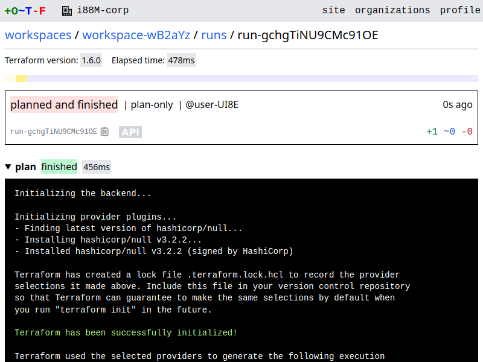
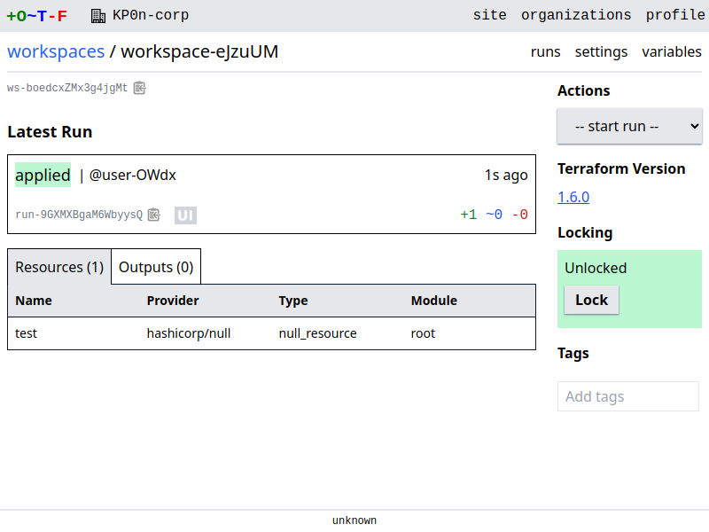
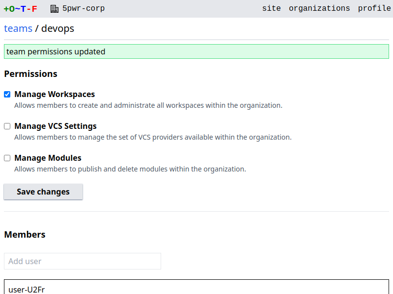
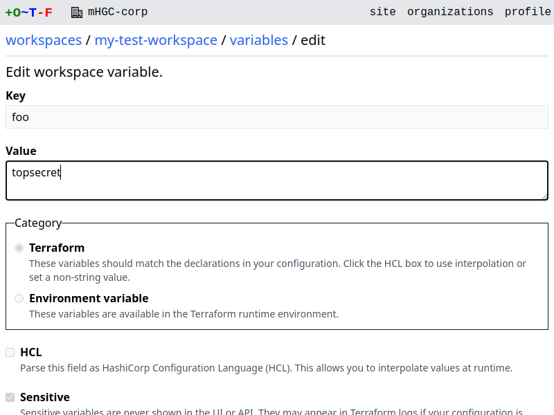

# Introduction

OTF is an open-source alternative to Terraform Enterprise, sharing many of its features:

* Full Terraform CLI integration
* Remote execution mode: plans and applies run on servers
* Agent execution mode: plans and applies run on agents
* Remote state backend: state stored in PostgreSQL
* SSO: sign in using an identity provider via OIDC, OAuth, etc.
* Module registry (provider registry coming soon)
* RBAC: control team access to workspaces
* VCS integration: trigger runs and publish modules from git commits
* Compatible with much of the Terraform Enterprise/Cloud API
* Minimal dependencies: requires only PostgreSQL
* Stateless: horizontally scale servers in pods on Kubernetes, etc

Feel free to trial it using the demo deployment: [https://demo.otf.ninja](https://demo.otf.ninja)

<figure markdown>
{.screenshot}
<figcaption>Real-time streaming of a terraform plan</figcaption>
</figure>

<figure markdown>
{.screenshot}
<figcaption>A status check for a pull request on github.com</figcaption>
</figure>

<figure markdown>
{.screenshot}
<figcaption>The main page for a workspace</figcaption>
</figure>

<figure markdown>
{.screenshot}
<figcaption>Setting organization-level permissions for a team</figcaption>
</figure>

<figure markdown>
{.screenshot}
<figcaption>Editing a workspace variable</figcaption>
</figure>
