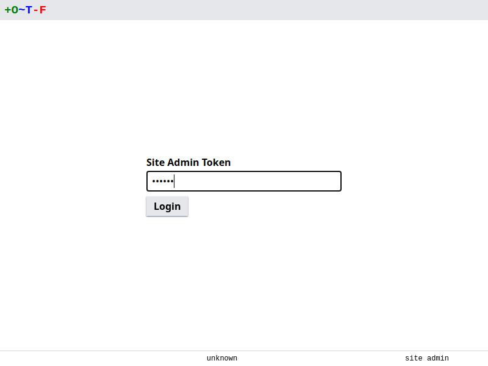
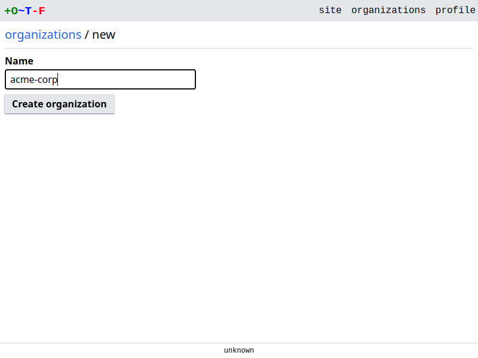
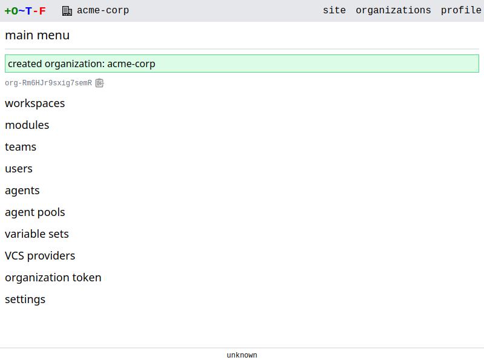
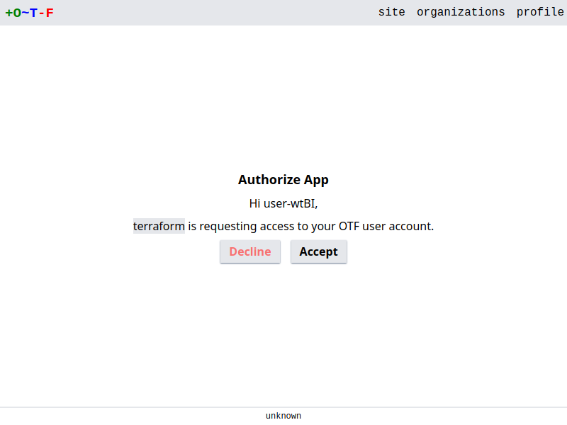

# Quickstart

These steps will get you started with running `otfd` on your local system.

Download a [release](https://github.com/leg100/otf/releases) of the server component, `otfd`. The release is a zip file. Extract the `otfd` binary to your current directory.

Ensure you have access to a postgres server. `otfd` by default assumes postgres is running locally, accessible via a domain socket in `/var/run/postgresql`, and defaults to using a database named `otf`. You need to create the database first:

```bash
createdb otf
```

At a minimum, `otfd` requires a [secret](../config/flags/#-secret) and a means of authentication. For the purposes of this quickstart we'll use a [site token](../config/flags/#-site-token):

```bash
> ./otfd --secret=6b07b57377755b07cf61709780ee7484 --site-token=my-token
2022-10-30T20:06:10Z INF started cache max_size=0 ttl=10m0s
2022-10-30T20:06:10Z INF successfully connected component=database path=postgres:///otf?host=/var/run/postgresql
2022-10-30T20:06:10Z INF goose: no migrations to run. current version: 20221017170815 compone
nt=database
2022-10-30T20:06:10Z INF started server address=[::]:8080 ssl=false
```

!!! note
    The secret must be a hex-encoded 16-byte array

You have now successfully installed `otfd` and confirmed you can start `otfd` with minimal configuration. Proceed to create your first organization.

#### Create organization

Navigate to the web app in your browser, [http://localhost:8080](http://localhost:8080):

{.screenshot}

Note it announces you have `no authenticators configured`. The normal method of login is to use SSO signin, via Github etc, but in this quickstart we're using the site admin account. Click on `site admin` in the bottom right, and use your token to login.

{.screenshot}

{.screenshot}

Go to **organizations > New Organization**. Give the organization a name and create.

{.screenshot}
{.screenshot}

#### Run Terraform

!!! Note
    The terraform CLI will be connecting to the server and it expects to make a verified SSL connection. Therefore we need to configure SSL first.

Generate a self-signed SSL certificate and key:

```bash
openssl req -x509 -newkey rsa:4096 -sha256 -keyout key.pem -out cert.crt -days 365 -nodes -subj '/CN=localhost' -addext 'subjectAltName=DNS:localhost'
```

Ensure your system trusts the generated cert. For example, on Ubuntu based systems:

```bash
sudo cp cert.crt /usr/local/share/ca-certificates
sudo update-ca-certificates
```

Now return to the terminal in which `otfd` is running. You'll need to kill it and start it again, this time with SSL enabled:

```bash
> ./otfd --secret=6b07b57377755b07cf61709780ee7484 --site-token=my-token --ssl --cert-file=cert.crt --key-file=key.pem
```

Terraform needs to use your token to authenticate with `otfd`:

```bash
terraform login localhost:8080
```

Enter `yes` to proceed. A browser window is opened where you give consent to `terraform` to access your OTF account:

{.screenshot}

Once you give your consent you should be notified you can close the browser and return to the terminal:

{.screenshot}

In the terminal you should see the confirmation of success:

```
Success! Terraform has obtained and saved an API token.
```

Now we'll write some terraform configuration. Configure the terraform backend and define a resource:

```bash
cat > main.tf <<EOF
terraform {
  backend "remote" {
    hostname = "localhost:8080"
    organization = "default"

    workspaces {
      name = "dev"
    }
  }
}

resource "null_resource" "quickstart" {}
EOF
```

Initialize terraform:

```bash
terraform init
```

Run a plan:

```bash
terraform plan
```

That starts a run on the server. You can click on the link to the run to view status and logs.

And apply:

```bash
terraform apply
```

This starts another run on the server. Again you can click on the link to see logs.

You have reached the end of this quickstart guide. Have a look at the remainder of the documentation to further complete the installation of OTF, to setup SSO, run agents, etc.
