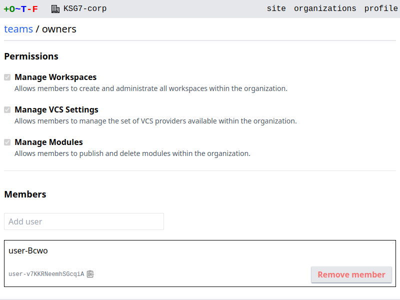
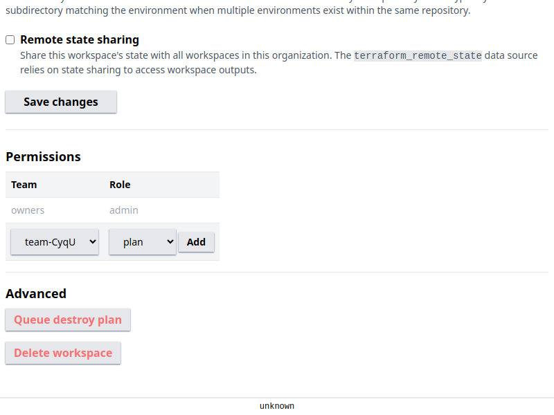

# RBAC

The authorization model largely follows that of Terraform Cloud/Enterprise. An organization comprises a number of teams. A user is a member of one or more teams. Teams are assigned permissions permitting access to various functionality. Team permissions can be assigned at two levels: on organizations and on individual workspaces.

## Owners

Every organization has an `owners` team. The user that creates an organization becomes its owner. The owners team must have at least one member and it cannot be deleted.

Members of the owners team possess broad privileges across an organization. Owners are the only users permitted to alter organization-level permissions. They are also automatically assigned all the organization-level permissions; these permissions cannot be unassigned.

## Permissions

Permissions are assigned to teams on two levels: organizations and workspaces. Organization permissions confer privileges across the organization:

* Manage Workspaces: Allows members to create and administrate all workspaces within the organization.
* Manage VCS Settings: Allows members to manage the set of VCS providers available within the organization.
* Manage Registry: Allows members to publish and delete modules within the organization.

{.screenshot}

Workspace permissions confer privileges on the workspace alone, and are based on the [fixed permission sets of TFC/TFE](https://developer.hashicorp.com/terraform/cloud-docs/users-teams-organizations/permissions#fixed-permission-sets):

* Read
* Plan
* Write
* Admin

<figure markdown>
{.screenshot}
<figcaption>Workspace permissions on workspace settings page</figcaption>
</figure>

See the [TFC/TFE documentation](https://developer.hashicorp.com/terraform/cloud-docs/users-teams-organizations/permissions#fixed-permission-sets) for more information on the privileges each permission set confers.

## Site Admins

Site admins possesses supreme privileges across an OTF cluster. There are two ways to assume the role:

* Use a [site token](../config/flags/#-site-token) to login as the `site-admin` user
* Promote users to the role using the [`--site-admins` flag](../config/flags/#-site-admins)
