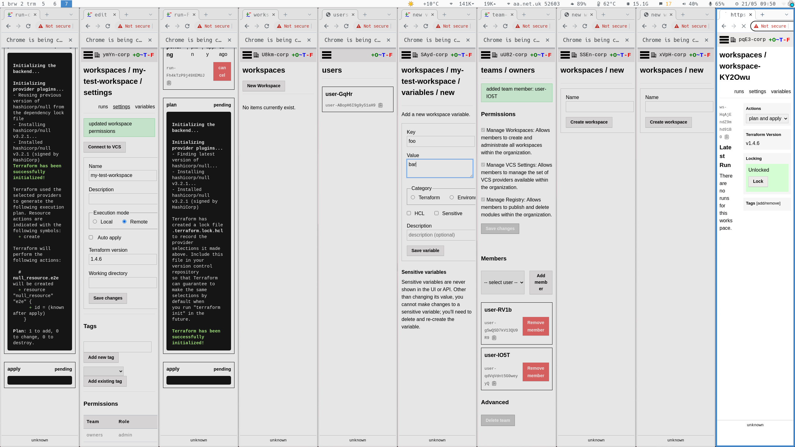

# Tests

### Unit tests

Change into the repo directory and run unit tests:

```
go test ./...
```

### Integration tests

Integration tests require:

* PostgreSQL
* Terraform >= 1.2.0
* Chrome

Set the environment variable `OTF_TEST_DATABASE_URL` to a valid connection string. For example, if you have installed postgres on your local machine with the default database `postgres`:

```
export OTF_TEST_DATABASE_URL=postgres:///postgres
```

Then run the both unit and integration tests:

```
go test ./...
```

!!! note
	Tests check for the presence of `OTF_TEST_DATABASE_URL`. If it absent then only unit tests are run; otherwise both unit and integration tests are run.

#### Postgres too many connections error

When running integration tests you may run into this error:

```
FATAL: sorry, too many clients already
```

The tests make potentially hundreds of connections to postgres at a time and you'll need to increase the maximum number of connections in postgres. Increase the `max_connections` parameter on your installation:

```
psql postgres:///otf
alter system set max_connections = 999;
```

Then reload/restart postgres. On Ubuntu, for example:

```
sudo systemctl reload postgres
```

!!! note
    This is only recommended for a postgres installation dedicated to development and testing purposes. Too many connections in production most likely indicates a problem with the client application.


#### Postgres performance optimisation

To further improve the speed of your integration tests turn off `fsync`:

```
psql postgres:///otf
alter system set fsync = off;
```

Then reload/restart postgres. On Ubuntu, for example:

```
sudo systemctl reload postgres
```

!!! note
    This is only recommended for a postgres installation dedicated to development and testing purposes. Disabling `fsync` can lead to data loss.

#### Database cleanup

A dedicated logical database is created in postgres for each individual
integration test; as a result the above command creates 100s of databases. Upon
test completion the databases are removed. In certain situtations upon a test
failure the test may fail to remove a database, in which case you will have to
manually remove the database (although this is often not a concern other than
consuming a small amount of disk space).

#### Disable headless mode

Browser-based tests spawn a headless Chrome process. In certain situations it
can be useful to disable headless mode, e.g. if a test is stuck on a certain
page and you want to know which page. To disable headless mode:

```
export OTF_E2E_HEADLESS=false
```

<figure markdown>
{.screenshot}
<figcaption>Integration tests with headless mode disabled</figcaption>
</figure>

#### Cache provider requests

Terraform-based tests spawn `terraform`. These tests retrieve providers from
the internet which can consume quite a lot of bandwidth and slow down the tests
significantly. To cache these providers it is recommended to use a caching
proxy. The following make task runs [squid](http://www.squid-cache.org/) in a
docker container:

```
make squid
```

It is configured to use
[SSL-bumping](https://wiki.squid-cache.org/Features/SslBump), which permits
caching content transported via SSL (`terraform` retrieves providers only via
SSL).

You then need to instruct the tests to use the proxy:

```
export HTTPS_PROXY=localhost:3128
```

You should now find the tests consume a lot less bandwidth and run several times
faster.

### API tests

Tests from the [go-tfe](https://github.com/hashicorp/go-tfe) project are routinely run to ensure OTF correctly implements the documented Terraform Cloud API. However, OTF only implements a subset of the API endpoints, and there are some differences (e.g. an OTF organization has no email address where as a TFC organization does). Therefore a [fork](https://github.com/leg100/go-tfe) of the go-tfe repo is maintained.

The make task:

```
make go-tfe-tests
```

performs the following steps:

* Starts a docker compose stack of `otfd`, postgres, and [squid](#cache-provider-requests)
* Runs a subset of `go-tfe` tests using the **forked** repo
* Runs a subset of `go-tfe` tests using the **upstream** repo

!!! note
    You can instead manually invoke API tests using the scripts in `./hack`. The tests first require `otfd` to be running at `https://localhost:8833`, with a [site token](../config/flags/#-site-token) set to `site-token`. These settings can be overridden with the environment variables `TFE_ADDRESS` and `TFE_TOKEN`.
